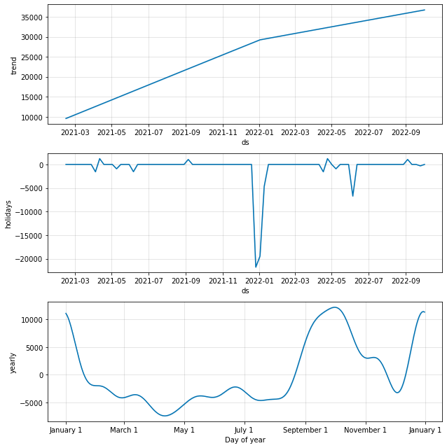

## The Model

Facebook's prophet model is of the form:

$$ X_{t} = g(t) + s(t) + h(t), \; \; \; \epsilon_{t} \sim \mathcal{N}(0, \sigma), \; i.i.d$$

$g(t)$: Models the growth. It can capture linear trends as well as more complex trends over time.

$s(t)$: Models seasonality. This term essentially just a uses fourier series to fit a wave-like pattern on top of the trend.

$h(t)$: An indicator function to allow holidays to be captured. 

So prophet is largely a deterministic model which assumes the patterns within the series can be modeled with fixed functions of time. Once again consider the weekly primary care time series.

The indivudals components fit by the prophet model are given below.

Note in particular, prophet works out that it needed a hinge in the trend to account for the fact the trend during adoption was steeper than the trend in 2022.

## Expected performance

It's hard to guess how this model might fair against SARIMA or simpler models without directly comparing their respective error rates. However, like with the SARIMA model, whilst the short term forecasts of the model might be reasonable, long-term forecasts will get increasingly worse as the trend is just extrapolated upwards. In reality we would expect some tapering off as app adoption slows.

## When will a prophet model work well?

One of the problems with using SARIMA models on a weekly time series, is that yearly seasonality can't be completely captured. This is because there are 365.25/7 = 52.18 weeks in a year on average, so the seasonality is a non-integer. The best SARIMA can do is look back 52 weeks. Prophet can handle non-integer seasonality, by enforcing a periodicity of 52.18 in the seasonal component.

Prophet does expect stability however. Random noise in the system can't propogate through into future values like with SARIMA. This means Prophet is less able to handle complex stochastic dependencies with time series. 

## Further Reading
A comprehnsive overview of how prophet works [can be found in this paper](https://peerj.com/preprints/3190.pdf).

