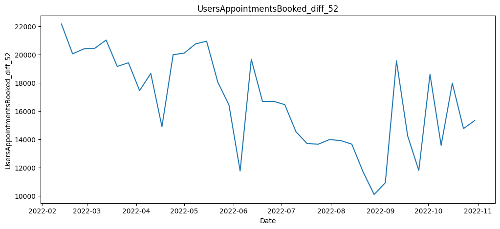
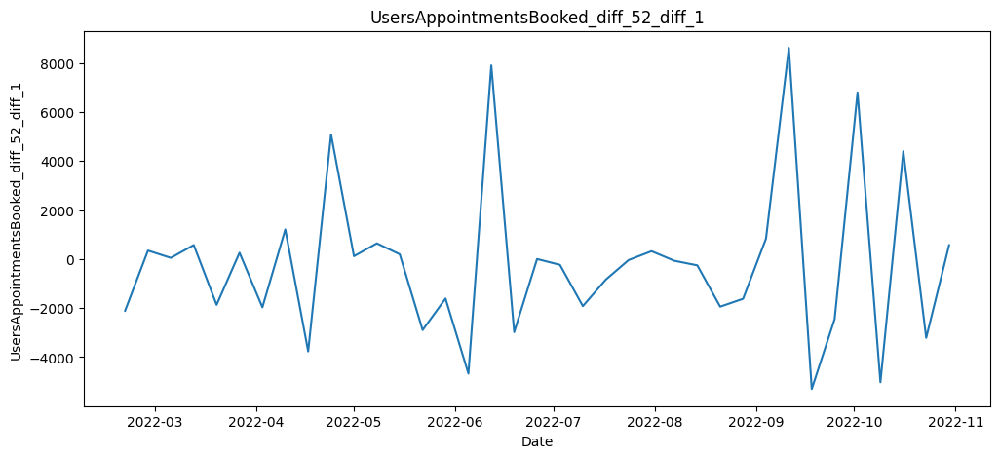
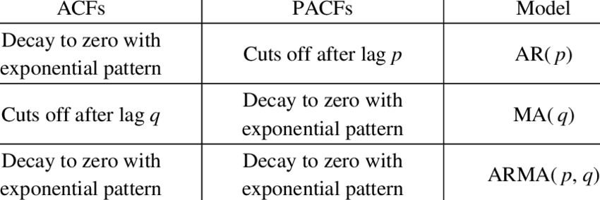
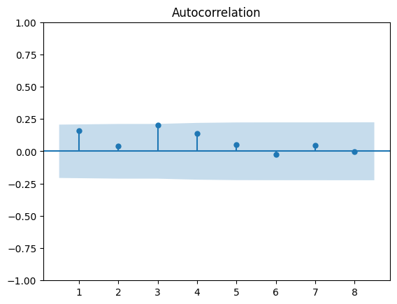

## The Model

ARMA (Autoregressive Moving Average) models are of the form:

$$ X_{t} = \phi_{1}X_{t-1} + ... + \phi_{p}X_{t-p} +
\theta_{1}\epsilon_{t-1} + ... + \theta_{q}\epsilon_{t-q} + \epsilon_{t}, \; \; \; \epsilon_{t} \sim \mathcal{N}(0, \sigma), \; i.i.d$$

The $X$ terms are called the autoregressive terms and the $\epsilon$ terms the moving average terms.

This models says that the value of the system today is a function of the systems historic values as well as the random jolts the system has experienced in the past.

An additional constraint on ARMA models is that they must be stationary. Loosely this means the properties of the time series don't change over time. In particular the time series must not exhibit any sustained trend. 

## Making a series stationary

Let's take the primary care weekly time series as an example. Although ultimately we're after monthly forecasts, a weekly model can be more dynamic. For example, we can use a 4 week ahead forecast to get an approximate 1 month out forecast. But then when 1 week of new data comes in, we can use a 3 week ahead forecast to update our monthly prediction. With a monthly model we are stuck with our 1 month ahead forecast.

Clearly the raw data exhibits some trend, so is non-stationary:

Differencing is required to induce stationarity. Differencing just means looking at the jumps between points in time instead of the points in time specifically. That is, instead of trying to model $X_{t}$, we model $Y_{t} = X_{t} - X_{t-52}$. A lag of 52 has been chosen as there looks to be some yearly seasonality in the time series. Differencing with a lag of $52$ will knock out the seasonal pattern. 

There is no more seasonality in the data, but there still looks to be some downward trend present (although the most recent data suggests this may be stabalising). We will apply one further round of differencing and consider $Z_{t} = Y_{t} - Y_{t-1}$.

When differencing has been applied we say the series has been integrated. This is what the 'I' standands for in ARIMA. 

## Modelling a stationary series

The series $Z_{t}$ exhibits no clear trend. This is only a necessary condition for stationarity but may not be sufficient. Note that the variance in this series doesn't appear uniform in magnitude. An assumption of the ARIMA model was that the jolts to the system (the $\epsilon$'s) each share the same variance $\sigma$. This assumption may be violated by this series. Sometimes however, these modelling assumptions can be violated and still produce reasonable forecasts so don't throw the model away just because this constant variance assumption isn't completely met.

The values of $p$ and $q$ may be selected via analysis of the 'acf' and 'pacf' plots. Autocorrelation function (acf) plots show how correlated points separated by a lag of k are with one another. So the k'th spike in the acf plot is given by $corr(Z_{t-k}, Z_{t})$. Partial autocorrelation function plots show how correlated points separated by a lag of k are, given we have accounted for the intermediary effects of $Z_{t-1},...,Z_{t-(k-1)}$. It may be shown that the link between the parameters $p$ and $q$ and these plots is given by:

Below are the plots for our series $Z_{t}$.

The ACF cuts off sharply after lag 1 and the PACF looks to decay. Therefore a MA(1) term seems like a good choice. That is, we suggest a model of the form 

$$Z_{t} = \epsilon_{t} + \theta_{1} \epsilon_{t-1}$$

## Checking the fit of the model

Is this model a good fit? If it is, then when we use this model to fit the series $Z_{t}$, we wouldn't expect there to be any indentifiable patterns left in the residuals. Otherwise there's something our model isn't capturing properly in the series. Note, the residuals of the fitted series are just the random jolts $\epsilon_{t}$ at each point in time. To see if there are any patterns remaining we plot the acf and pacf of the residuals.

The correlations now don't look to be significant, so we'll accept the model. 

## The final model

So we've settled on a model of the form:

$$Z_{t} = \epsilon_{t} + \theta_{1} \epsilon_{t-1}$$

Given $Z_{t} = Y_{t} - Y_{t-1}$, this means our model for $Y_{t}$ is

$$Y_{t} = Y_{t-1} + \epsilon_{t} + \theta_{1} \epsilon_{t-1}$$

And given $Y_{t} = X_{t} - X_{t-52}$, this means our model of the original series $X_{t}$ is

$$X_{t} = X_{t-1} + (X_{t-52} - X_{t-53})  + \epsilon_{t} + \theta_{1} \epsilon_{t-1}$$

Because we have a seasonal component to our model (the $X_{t-52}$ term), we called this a seasonal ARIMA model, or SARIMA for short.

## Do we expect this model to outperform a simple model?

Note the autoregressive part of this model just says that where we are this week is where we were last week, plus the jump between the same points in time last year! So the selected model is just a very simple additive model with an additional lagged moving average term. Given this, we might not expect loads of improvement over a simple additive model without the moving average terms. Furthermore if we were to forecast 4 weeks out with this model we get:

$$\overline{X}_{t+1} = X_{t} + (X_{t-51} - X_{t-52})+ \theta_{1}\epsilon_{t}$$

$$\overline{X}_{t+2} = \overline{X}_{t+1} + (X_{t-50} - X_{t-51})$$

$$\overline{X}_{t+3} = \overline{X}_{t+2} + (X_{t-49} - X_{t-50})$$

$$\overline{X}_{t+4} = \overline{X}_{t+3} + (X_{t-48} - X_{t-49})$$

Since we don't have any way of knowing the error terms in the future as they're assumed to be independent from one another, we have to assume they equal zero. So the inclusion of the lagged moving average term is only really realised in $\overline{X}_{t+1}$. This means when we aggregate up our 4 week out forecast to generate a 1 month out forecast, we can't expect much improvement over the simple additive model.

## How far ahead can we forecast with this model?

Short term forecasts of the model might be reasonable. However, long-term forecasts will get increasingly worse as the trend continues linearly upwards. In reality we would expect some tapering off as app adoption slows.

## When will SARIMA models work well?

Imagine instead this model applied equally well to the monthly data, then we might expected this SARIMA model to perform a bit better than the simple additive model for a 1 month out forecast. Why? Because we can take advantage of the lagged moving average term in this 1 step ahead forecast. Unfortunately, there just isn't enough data to fit a monthly model. Having too little data can mean more complex patterns may not yet be indentifiable or that the estimates of the $\phi$'s and $\theta$'s may not have converged properly, leading to poor forecasts. However as more data comes in, a monthly SARIMA model may turn out to be a good monthly forecasting tool. Also, with more data, the tapering off of the trend should be more pronounced. SARIMA models are capable of capturing this non-linear trend.

SARIMA models tend to work better than these simple models when there are more complex patterns in the time series, i.e time series which require multiple $\phi$ and $\theta$ terms. These series might look less 'structured' and the underlying pattern might be hard to detect visually. In this case the weekly time series looks to have quite a structured trend and seasonality to the data. This is reflected in the simplicity of the chosen model.

## Further Reading
There are many more thigs to consider when fitting SARIMA models. In particular,

- How do we actually know if our series is stationary rather than just looking stationary?
- How do we account for bank holidays?
- What if there are seasonal spikes in the acf and pacf?
- What if the residual acf and pacf plots still show correlations?
- How do we know whether a term in our chosen model is actually improving predictive performance?

All of these questions are answered in 'Forecasting with Univariate Box-Jenkins Models - Concepts and Cases' by Alan Pankratz. [Click here for a free pdf](https://bayanbox.ir/view/5026844611947961592/Pankratz-Forecasting-with-univariate-Box-Jenkinse-Models.pdf).

